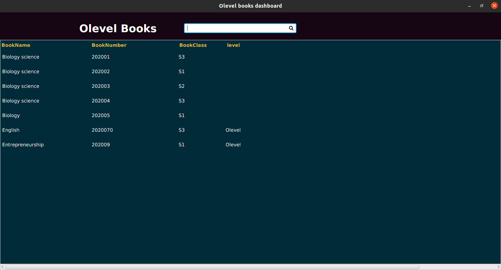

# Library Management System

This is the library management software system developed using java with its javafx framework. for more information on
this system dont hesitate to contact me via my
email [mugishalain81@gmail.com](https://www.google.com/search?q=gmail&oq=gmail&aqs=chrome.0.69i59j0i131i433i512l2j0i433i512l2j69i61j69i60j69i61.3594j0j4&client=ubuntu&sourceid=chrome&ie=UTF-8)

### Libraries used are:

* [Openjfx-15.01](https://openjfx.io/)
* [scenebuilder-kit-8.5](https://gluonhq.com/products/scene-builder/)
* [mysql-connector-java-8.0](https://www.mysql.com/products/connector/)
* [openjdk-15](https://openjdk.java.net/)
* [fontawesomefx-8.0.8](https://jar-download.com/artifacts/de.jensd/fontawesomefx/8.0.8/source-code)
* [charm-glisten-4.4](https://jar-download.com/?search_box=com.gluonhq.charm)

### Default login credentials

| Username  | Password |
| ------------- | ------------- |
| mugisha alain  | 01021380  |

### IMAGES

  
